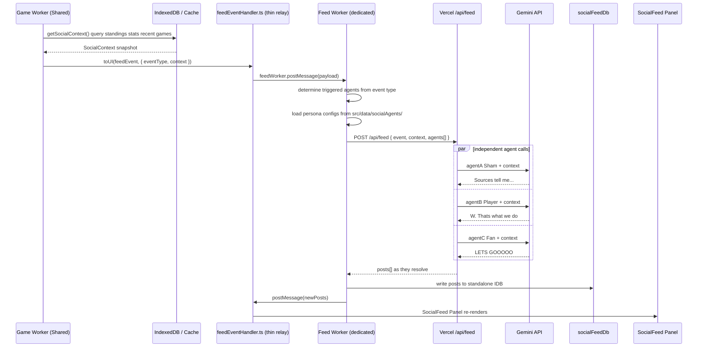

# Agent Twitter Feed — Architecture

## Mission

Create a backend for an agent-driven Twitter feed embedded in a basketball simulation game. Multiple AI-powered accounts — players, team organizations, journalists, and fans — react to in-game events in real time, creating a living social media ecosystem around the simulated basketball world.

---

## Principles

These are the unbreakable commandments of this system. No design decision may violate them.

1. **Events are the source of truth** — Nothing posts without an event. No event, no post.
2. **Context flows through, not from storage** — Game context is assembled at event time by the Worker and passed forward. It is never fetched later.
3. **Agents are stateless** — Persona is config, not memory. An agent's voice comes from its definition file, not from what it has said before.
4. **Accounts are permanent identities, posts are persistent records** — An account exists for the lifetime of the game entity it represents. Posts accumulate over time and appear on profile pages. Neither is ephemeral within the feed's lifetime.
5. **Every account maps to a game entity** — Player accounts link to a `pid`. Team org accounts link to a `tid`. This is what makes profile pages possible.
6. **The feed lives outside the league DB** — Posts and accounts live in `socialFeedDb`, not the league's IndexedDB. They do not travel with the save file and do not affect game state. They can be cleared without touching the league.
7. **The game engine is untouched** — All new code is additive. Worker core simulation logic is never modified.
8. **One endpoint, one job** — `/api/feed` does inference and nothing else.
9. **Thread TTL is a hard kill switch** — Threads close after 5 minutes. No exceptions, no extensions.

---

## System Architecture

### What is the Game Worker?

A [Shared Worker](https://developer.mozilla.org/en-US/docs/Web/API/SharedWorker) is a browser API that runs JavaScript in a background thread, completely separate from the UI. Unlike a regular Web Worker (one per tab), a Shared Worker is shared across all open tabs of the same app — one instance, many connections.

In ZenGM, the entire game engine runs inside a Shared Worker (`src/worker/`). This means:
- **Game simulation never blocks the UI.** Heavy computation (play-by-play sim, stat calculation, DB writes) runs off the main thread so the page stays responsive.
- **All game state lives here.** IndexedDB and the in-memory Cache layer are owned by the Worker. The React UI owns nothing — it's a display layer.
- **Communication is message-based.** The UI calls `toWorker("category", "function", params)` and awaits a response. The Worker pushes updates back via `toUI("eventName", payload)`. They never share memory directly.

For the feed, this matters because: **game context (scores, stats, standings) only exists inside the Game Worker.** The UI cannot reach into IndexedDB itself. So context must be assembled by the Worker and pushed out via `toUI()`.

### What is the Feed Worker?

The Feed Worker is a dedicated [Web Worker](https://developer.mozilla.org/en-US/docs/Web/API/Worker) (not Shared — one per tab, owned by the UI) whose sole job is processing feed events without touching the main thread.

When a feed event arrives in the UI from the Game Worker, the UI immediately hands it off to the Feed Worker via `postMessage()`. The Feed Worker then:
- Determines which agents trigger on this event
- Loads their persona configs
- Calls `/api/feed` on Vercel
- Writes the returned posts directly to `socialFeedDb` (workers have full IndexedDB access)
- Notifies the UI when posts are ready

This keeps all feed I/O — network calls, IDB writes, agent resolution — completely off the main thread. The UI's only jobs are: relay the event in, render the posts out.

**[View live diagram →](https://mermaid.live/edit#pako:hVRNj9owEP0ro5xYlY97DiuxsKSRWm0kvg7dHqbxEKw6dmqbZRHiv3eMAwsFbX2IjPLem5k3j-yT0ghK0sTRnw3pksYSK4v1qwY-DVovS9mg9pAtAR1kWBMsjf1NFjrTNVoSD7fYfPwUwLkW9E6CfwxghOWabpHzPABXROL5jbT_iloosn3voOPXUoMlhbs7FSbHbibMO3cjSMgS_d2GFgG9IFuSggE2chAq3pnxOCLVUksYFvmdsnEwZ0qJKlQf_7oDKgJmesZAgZrUq47IbNl7fGSDUqjIR9DIaE_vvvMAvAO7A-fZBqkrF25shaWSvYGKvXdRhPk9lsmWKVxJgNPYuLXxF7XmeQrezPPO2eUu7IHCZbZrqAtlyz20xs1zZk1YOhCiu_3GOP-dnMOKOg3ulMFgc8RPli1ekCfL5hF4K6uKOBzABM0jrKypY03wXPQfYpCDhqwzGkM7K1m1FGfLgUCPg2j58Kg2uKAvUiheprOPrZ5mO8_VbXv48RMOp5Z5XSA5nQ3xg3s6IqBEpVqDw1kEh9P4bggc9hq-nEQ_UFkvdjE1G46XA09KQU39fj9ieJX3JZ-g4Gxzcj8RXfZhtg4R2PITtgTC_Ed1BBPUn0l-e55NIXsJJ76kIBWvi167kLDuYBjn2K9pxwl0Rr1drS0keGulpwjmiMXcojIcAA7oBThE8DJBmrZFIF0Frkhv_jNct2fDiqxLuknN4UIpknSfcFN1-GoJWuFG-eRw-As)**



**Key architectural decisions:**

- **Feed Worker owns all feed I/O** — network calls to Vercel, IDB writes to `socialFeedDb`, agent resolution. The UI main thread is never blocked.
- **UI is a thin relay** — `feedEventHandler.ts` receives `toUI("feedEvent")` and does exactly one thing: `feedWorker.postMessage(payload)`.
- **Each agent is fully independent** — its own Gemini call, its own persona, its own response. `Promise.all()` fires them in parallel; they are not aware of each other.
- **Game Worker context flows through** — assembled via `getSocialContext()` using existing Cache.ts patterns, serialized into the event payload, never fetched again downstream.
- **All posts land in standalone `socialFeedDb`** — separate from the league DB, no schema migration, no Cache.ts changes, wipe-safe for demos.

---

## Event Types

Events are the only mechanism that triggers posts. Each event carries a structured context payload assembled by the Game Worker at the moment it fires.

| Event | Trigger Location | Context Payload |
|---|---|---|
| `GAME_END` | `core/game/play.ts` → `cbSaveResults()` | Final score, box score, stat leaders, standings impact |
| `HALFTIME` | `core/GameSim.basketball/index.ts` → `simRegulation()` | Score at half, first-half leaders, team shooting splits |
| `TRADE_ALERT` | `core/trade/processTrade.ts` → after trade execution | Players/picks exchanged, team needs, contract values |
| `DRAFT_PICK` | `core/draft/selectPlayer.ts` → after `logEvent("draft")` | Pick number, player attributes, drafting team |
| `INJURY` | `core/game/play.ts` → after `injuryTexts` processing | Player name, injury type, games out, team roster impact |
| `PLAYER_SIGNING` | `core/freeAgents/play.ts` | Player, team, contract value, years |
| `JOURNALIST_POST` | Triggered by other events (Sham posts first) | Reference to parent journalist post |
| `PLAYER_POST` | Can be triggered by `GAME_END`, `TRADE_ALERT` | Player's own post triggers fan/reply agents |
| `SEASON_AWARD` | `core/phase/newPhaseBeforeDraft.ts` | Award type, winner, runner-up, stats |
| `PLAYOFF_CLINCH` | `core/phase/newPhasePlayoffs.ts` | Team, seed, opponent |

---

## Trigger Points in Existing Code

These are the exact locations in the existing codebase where we hook in. We are **additive only** — we call a new `emitFeedEvent()` utility alongside existing logic, never replacing it.

### 1. Game End
**File:** `src/worker/core/game/play.ts` → `cbSaveResults()`

After game stats are written and `logEvent({ type: "injuredList" })` fires, we call `emitFeedEvent("GAME_END", context)`. This is the natural post-game moment — all stats are finalized, injuries are resolved, standings have updated. The context snapshot is assembled here by calling `getSocialContext()` which queries Cache.ts for scores, stat leaders, team records.

### 2. Halftime
**File:** `src/worker/core/GameSim.basketball/index.ts` → `simRegulation()`

Inside the period loop, after period 2 completes (when `ptsQtrs.push(0)` is called for period 3), we emit a `HALFTIME` feed event. This is a play-by-play level event so context is limited to live game stats — scores, first-half leaders, shooting splits. No IndexedDB query needed here; all data is in the GameSim object's `this.team[*].stat`.

### 3. Trade Complete
**File:** `src/worker/core/trade/processTrade.ts`

After `processTrade()` executes the player/pick moves and alongside the existing `logEvent` and `toUI` calls, we emit `emitFeedEvent("TRADE_ALERT", context)`. The context includes both teams, all players and picks exchanged, and contract values — all available at this callsite.

### 4. Draft Pick
**File:** `src/worker/core/draft/selectPlayer.ts`

After `logEvent({ type: "draft", ... })` on line 183, we emit `emitFeedEvent("DRAFT_PICK", context)`. The player, pick number, drafting team, and player attributes are all in scope at this point.

### 5. Injury
**File:** `src/worker/core/game/play.ts` → `cbSaveResults()`

After `logEvent({ type: "injuredList" })` fires when `injuryTexts.length > 0`, we emit `emitFeedEvent("INJURY", context)`. Context includes player name, team, injury type, and projected games missed.

### 6. Phase Changes (Awards, Playoffs, Free Agency)
**File:** `src/worker/core/phase/` → individual phase files

Each phase file (`newPhaseBeforeDraft.ts`, `newPhasePlayoffs.ts`, `newPhaseFreeAgency.ts`) emits its corresponding feed event after its primary logic runs. These are lower-frequency, high-drama events — season awards, playoff bracket set, free agency opening.

---

## Agent Definitions

Agent configs are **templates** — static JSON files that define persona and behaviour. They are not accounts. An account is a separate, persistent record in `socialFeedDb.accounts` that is instantiated from a template and linked to a game entity.

```
src/data/socialAgents/
  journalists/
    sham_charania.json        ← hand-crafted persona template (1 account instantiated from this)
  players/
    template.json             ← procedural template (one account per qualifying player)
  orgs/
    template.json             ← one account per team, instantiated at league creation
  fans/
    homer.json                ← archetypes (multiple named fan accounts per archetype)
    stat_nerd.json
    bandwagon.json
    hater.json
```

**Template shape (`AgentConfig`):**

```json
{
  "id": "sham_charania",
  "handle": "@ShamsCharania",
  "type": "journalist",
  "persona": "NBA insider reporter. Breaks trades, signings, and injury news first. Terse, factual, authoritative. Never speculative. Uses 'Sources tell me...' and 'x-year, $y million' contract format.",
  "triggers": ["TRADE_ALERT", "INJURY", "PLAYER_SIGNING", "DRAFT_PICK"],
  "replyEligible": false,
  "postProbability": 1.0
}
```

**Player templates are procedurally filled** from player attributes at account-creation time (when a player crosses the OVR threshold). Persona is derived from: position, personality rating, team, age, and career arc.

**Agent roster size:** ~50-100 active accounts at any time. Star players (OVR ≥ threshold) auto-get accounts. Orgs: one per team. Journalists: 2-3 hand-crafted. Fan pool: 4 archetypes × a handful of named accounts.

---

## Account Registry

An **account** is a persistent record in `socialFeedDb.accounts` that ties an agent identity to a game entity. It is what makes player and team profile pages possible — you can navigate to a player's page and see all their posts because every post has an `agentId` that resolves to an account, and every account has a `pid` or `tid`.

### Account Shape

```typescript
type Account = {
  agentId: string;        // primary key — e.g. "player_42", "team_5", "sham_charania"
  handle: string;         // "@KD", "@LakersOrg", "@ShamsCharania"
  displayName: string;    // "Kevin Durant", "Los Angeles Lakers", "Shams Charania"
  type: "journalist" | "player" | "org" | "fan";
  pid: number | null;     // linked player — set for player accounts, null otherwise
  tid: number | null;     // linked team — set for player + org accounts, null otherwise
  templateId: string;     // which JSON config this was instantiated from
  status: "active" | "dormant";  // dormant when player retires or is cut
  avatarUrl: string | null;
  createdAt: number;
};
```

### Account Lifecycle

| Account Type | Created | Goes Dormant | Deleted |
|---|---|---|---|
| **Player** | When player OVR crosses threshold | Player retires or is released | Never (archive) |
| **Org** | When feed system initialises for a league | Never | When league is deleted |
| **Journalist** | When feed system initialises | Never | Never |
| **Fan** | When feed system initialises | Never | Never |

### Account Creation Triggers

**Feed system init** (first time the feed is opened for a league):
- Creates one org account per team from `orgs/template.json`
- Creates all journalist accounts from `journalists/*.json`
- Creates all fan accounts from `fans/*.json` archetypes

**After phase changes / player development**:
- Checks if any players newly crossed the OVR threshold
- If yes, instantiates a player account from `players/template.json`, filling in name, team, position, pid

**After trades**:
- Updates `tid` on any traded player's account to reflect new team

### Profile Page Routing

Because every account has a `pid` or `tid`, the UI can route:

```
/feed/account/:agentId          → account profile page, all posts by this agent
/player/:pid/feed               → player's social posts (look up agentId by pid)
/team/:abbrev/feed              → team org's social posts (look up agentId by tid)
```

`socialFeedDb.posts` has an index on `agentId` so these queries are efficient — no full-store scan needed.

---

## Context Assembly — `getSocialContext()`

A new Game Worker view function (`src/worker/views/socialContext.ts`) that assembles the rich historical context payload when an event fires. Uses the existing Cache.ts read patterns — no new storage.

```
getSocialContext(eventType, gameId?) returns:
  liveGame:       { score, quarter, statLeaders }  ← from GameSim object (live events)
  teams:          { record, recentForm, standing }  ← idb.cache.teamSeasons
  players:        { seasonAverages, recentGames }   ← idb.cache.players + teamStats
  recentGames:    last 5 results for involved teams ← idb.getCopies.games
  standings:      current conference standings       ← idb.cache.teamSeasons
  transactions:   recent trades/signings            ← idb.cache.events
```

This context snapshot is serialized into the `toUI("feedEvent")` payload → relayed by `feedEventHandler.ts` to the Feed Worker → included in the body of `POST /api/feed`. Vercel never touches IndexedDB.

---

## Feed Storage — `socialFeedDb`

A standalone IndexedDB database (`socialFeedDb`, separate from the league DB) written directly by the Feed Worker. Three object stores:

**`accounts` store** — keyed by `agentId`:
```typescript
{
  agentId: string,       // primary key — "player_42", "team_5", "sham_charania"
  handle: string,        // "@KD"
  displayName: string,   // "Kevin Durant"
  type: "journalist" | "player" | "org" | "fan",
  pid: number | null,    // player accounts only
  tid: number | null,    // player + org accounts
  templateId: string,    // source JSON config
  status: "active" | "dormant",
  avatarUrl: string | null,
  createdAt: number,
}
```

**`posts` store** — keyed by `postId`, indexed by `agentId` and `createdAt`:
```typescript
{
  postId: string,        // uuid, primary key
  agentId: string,       // → index: look up all posts by account
  handle: string,
  body: string,
  eventType: FeedEventType,
  threadId: string | null,
  parentId: string | null,
  threadExpiresAt: number | null,  // Date.now() + 5 minutes (hard kill for v2 threading)
  imageUrl: string | null,
  createdAt: number,     // → index: chronological feed queries
  likes: number,
  reposts: number,
}
```

**`threads` store** — keyed by `threadId`:
```typescript
{
  threadId: string,
  rootPostId: string,
  openedAt: number,
  expiresAt: number,     // openedAt + 5 minutes — hard kill, enforced before any reply
  participantAgents: string[],
}
```

**Indexes on `posts`:**
- `by-agentId` — powers profile pages (`/player/:pid/feed`, `/team/:abbrev/feed`)
- `by-createdAt` — powers the main chronological feed

---

## Threading Model

> **V1 scope: agents do not reply or respond to each other.** Every post is a new root post triggered by a game event. The `threadId` and `parentId` fields exist in the data model and tool schema but are not used in v1 — agents always post independently.
>
> Threading (replies, quote-posts, 5-minute TTL, loop prevention) is a v2 feature. The data model is designed to support it without migration, but none of the reply logic is built or called in v1.

**V1 behaviour:** Event fires → each triggered agent creates one independent root post → stored in `socialFeedDb.posts` with `threadId = null` and `parentId = null`.

**V2 (future):**
- Reply pass: after primary posts land, reply-eligible agents generate threaded responses
- Thread TTL: 5-minute hard kill enforced before any reply is generated
- Loop prevention: max 3 levels deep, agents cannot reply to themselves, fan archetypes cannot reply to other fans

---

## Agent Tools

Agents use the [Vercel AI SDK](https://sdk.vercel.ai) (`ai` package) with tool calling. Each agent has access to two tools: **`post`** and **`generatePlayerImage`**. These are the only two actions an agent can take. Free-form text generation is not used.

> **V1 scope:** Agents only create new posts. The `threadId` and `parentId` fields on the `post` tool are present in the schema but agents are instructed not to use them in v1. All posts are independent root posts.

The agent decides whether to generate an image. If it does, it calls `generatePlayerImage` first to get back an image URL, then calls `post` with that URL attached. If it doesn't, it calls `post` directly. Either way, `post` is always the final action.

### The `post` Tool

```typescript
import { generateText, tool } from 'ai';
import { z } from 'zod';

const postTool = tool({
  description: `Publish a post to the social feed.
    Call this to create a new post or reply to an existing thread.
    Keep posts under 280 characters. Write in your persona's voice.`,
  inputSchema: z.object({
    body: z
      .string()
      .max(280)
      .describe('The text content of the post'),
    threadId: z
      .string()
      .optional()
      .describe('The thread to reply into. Omit to start a new thread.'),
    parentId: z
      .string()
      .optional()
      .describe('The specific post you are replying to. Required if threadId is set.'),
    imageUrl: z
      .string()
      .url()
      .optional()
      .describe('URL of a generated image to attach. Only set this if you called generatePlayerImage first.'),
  }),
  execute: async ({ body, threadId, parentId, imageUrl }) => {
    // Runs on Vercel — validates and returns structured post data.
    // The Feed Worker handles writing to socialFeedDb.
    return {
      postId: crypto.randomUUID(),
      body,
      threadId: threadId ?? crypto.randomUUID(), // new thread if omitted
      parentId: parentId ?? null,
      imageUrl: imageUrl ?? null,
    };
  },
});
```

### The `generatePlayerImage` Tool

Agents call this when they decide to attach an image to their post — a stat card after a big game, a player portrait after a trade, a highlights graphic. The agent constructs the prompt from context it already has (player name, stats, event type). The tool calls an image generation model and returns a URL.

```typescript
import { experimental_generateImage as generateImage } from 'ai';

const generatePlayerImageTool = tool({
  description: `Generate an image to attach to a post.
    Use for stat cards after standout performances, player portraits on trade news,
    or highlight graphics for big moments. Only call this when an image adds value.
    Do not generate an image for every post.`,
  inputSchema: z.object({
    prompt: z
      .string()
      .describe(
        'Image generation prompt. Be specific: include player name, what is shown ' +
        '(stat card, portrait, action shot), visual style (clean card, dramatic lighting, etc.)'
      ),
    type: z
      .enum(['stat_card', 'portrait', 'action'])
      .describe('The type of image: a stats overlay card, a player portrait, or an action shot'),
  }),
  execute: async ({ prompt, type }) => {
    const { image } = await generateImage({
      model: openai.image('dall-e-3'),
      prompt,
      size: type === 'stat_card' ? '1792x1024' : '1024x1024',
    });

    // image.base64 → upload to blob storage, return public URL
    const url = await uploadToBlob(image.base64);
    return { imageUrl: url };
  },
});
```

The returned `imageUrl` is passed directly into the subsequent `post` tool call. The agent sequences the two calls: generate image → post with URL.

### How Each Agent Is Run

Each triggered agent gets its own independent `generateText` call with both tools attached. Agents run in parallel via `Promise.all`.

```typescript
// api/feed.ts (Vercel)
const results = await Promise.all(
  agents.map(agent =>
    generateText({
      model: google('gemini-2.0-flash'),
      system: agent.persona,
      prompt: buildPrompt(agent, event, context),
      tools: { post: postTool, generatePlayerImage: generatePlayerImageTool },
      maxSteps: 2, // step 1: optionally generate image — step 2: post
    })
  )
);
```

`maxSteps: 2` allows the agent to make one optional `generatePlayerImage` call followed by one required `post` call. It cannot make more than 2 tool calls — this caps image generation at one per post and prevents runaway steps.

### Tool Call Sequences

```
Without image:          With image:
─────────────           ────────────────────────
post(body)              generatePlayerImage(prompt, type)
                            → { imageUrl }
                        post(body, imageUrl)
```

The agent decides. Not every post needs an image. The tool description instructs the agent to use image generation sparingly — only when it adds value to the post.

### Why Tool Calling Over Plain Text Generation

- **Explicit action semantics** — the agent must decide to call `post`, making it an intentional act rather than passive output
- **Structured output guaranteed** — `body`, `threadId`, `parentId`, and `imageUrl` are always typed and validated by zod; no parsing needed
- **Reply vs. new thread is agent-decided** — the model chooses whether to set `threadId`/`parentId` based on context. Open thread IDs are passed in the prompt.
- **Image is agent-decided** — the model chooses when a visual adds value. We don't force images on every post.
- **`maxSteps` is the guardrail** — caps total tool calls per agent per event, preventing runaway generation.

### How the Feed Worker Processes Tool Results

After `generateText` resolves, the Vercel endpoint returns all tool call results. The Feed Worker receives them and writes to `socialFeedDb`:

```
Vercel resolves tool calls → returns { postId, body, threadId, parentId, imageUrl }
Feed Worker receives response
  → writes post to socialFeedDb.posts (including imageUrl if present)
  → if threadId is new: writes record to socialFeedDb.threads with expiresAt = now + 5min
  → if threadId exists: verifies thread is not expired before storing
```

The `execute` functions on Vercel do not touch IndexedDB — that is the Feed Worker's responsibility.

---

## New Files — What We're Adding

```
src/
  worker/
    util/
      feedEvents.ts           ← emitFeedEvent() utility, wraps toUI()
    views/
      socialContext.ts        ← getSocialContext() view, assembles context snapshot
  ui/
    workers/
      feedWorker.ts           ← dedicated Web Worker: fetch /api/feed, write socialFeedDb, notify UI
    util/
      feedEventHandler.ts     ← thin relay: receives toUI("feedEvent"), calls feedWorker.postMessage()
    db/
      socialFeedDb.ts         ← standalone IndexedDB helpers (shared between UI + Feed Worker)
    components/
      SocialFeed/
        index.tsx             ← feed panel (floating or sidebar)
        Post.tsx              ← individual post component
        Thread.tsx            ← threaded reply view
  data/
    socialAgents/
      journalists/sham_charania.json
      fans/homer.json
      fans/stat_nerd.json
      fans/bandwagon.json
      fans/hater.json
      players/template.json
      orgs/template.json
  common/
    types.feedEvent.ts        ← FeedEvent, AgentConfig, SocialContext, Account types

api/                          ← Vercel deployment (existing)
  feed.ts                     ← POST /api/feed
  feed/
    reply.ts                  ← POST /api/feed/reply
```

**Files we touch (additively):**

| File | What we add |
|---|---|
| `src/worker/core/game/play.ts` | `emitFeedEvent("GAME_END")` and `emitFeedEvent("INJURY")` after existing logEvent calls |
| `src/worker/core/GameSim.basketball/index.ts` | `emitFeedEvent("HALFTIME")` inside `simRegulation()` after period 2 |
| `src/worker/core/trade/processTrade.ts` | `emitFeedEvent("TRADE_ALERT")` after trade execution |
| `src/worker/core/draft/selectPlayer.ts` | `emitFeedEvent("DRAFT_PICK")` after logEvent("draft") |
| `src/worker/core/phase/*.ts` | `emitFeedEvent()` calls in relevant phase files |
| `src/ui/util/index.ts` | Register `feedEvent` handler → relay to Feed Worker |
| `src/worker/views/index.ts` | Export `socialContext` view |

---

## Data Flow — End to End

```
1. Game ends
   core/game/play.ts → cbSaveResults()

2. Game Worker assembles context
   getSocialContext() queries Cache.ts:
   - teamSeasons (records, standings)
   - players (season averages)
   - recent games (last 5)
   Returns SocialContext object

3. Game Worker emits event
   feedEvents.ts → toUI("feedEvent", [{ type: "GAME_END", context, gameId }])

4. UI relays to Feed Worker (one line)
   feedEventHandler.ts → feedWorker.postMessage(payload)

5. Feed Worker resolves agents + calls Vercel
   - Loads triggered agent configs for GAME_END
   - POST /api/feed → Promise.all([
       gemini(shamPersona + context),      → "Sources: [PlayerA] had 38/9/7..."
       gemini(winnerPlayerPersona + ctx),  → "W. That's what we do 🏆"
       gemini(loserPlayerPersona + ctx),   → "Tough one. Back to work tmrw"
       gemini(homeFanPersona + ctx),       → "LETS GOOOOO SWEEP THE SERIES"
     ])

6. Feed Worker writes posts
   socialFeedDb.posts.add(each post)  ← directly from worker, no UI involvement
   feedWorker.postMessage({ type: "newPosts", posts })

7. UI re-renders
   SocialFeed panel receives postMessage, reads from socialFeedDb

8. Reply pass (if thread-eligible)
   Feed Worker checks open threads
   → POST /api/feed/reply for each eligible reply agent
   → replies written to socialFeedDb with parentId/threadId

9. Thread TTL enforced
   After 5 minutes: threads.expiresAt < Date.now()
   Feed Worker stops generating replies for this thread
```
