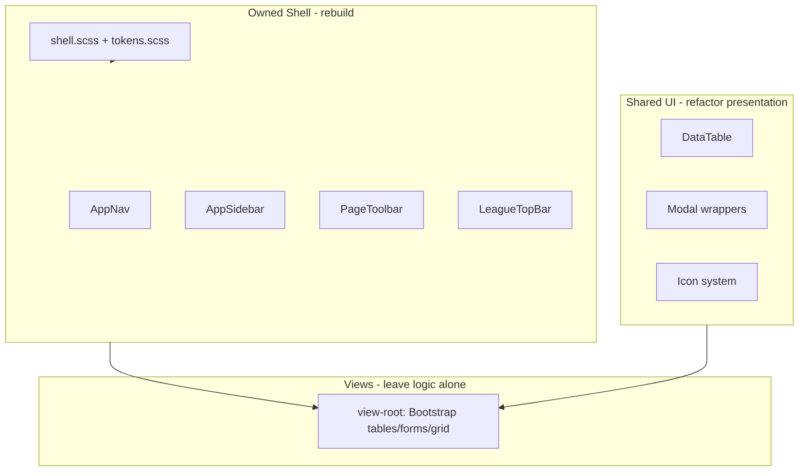

# ZenGM App Shell Redesign — Full Plan

Personal fork goal: a cohesive, bold UI that does not fight itself on every page. **Game logic stays untouched** — all work is presentation in `src/ui/` and `public/css/`.

---

## Problem statement

The current UI stacks three systems that negotiate every pixel:

1. **Bootstrap** (global CSS + react-bootstrap)
2. **ZenGM design tokens** (`--zengm-*` in `:root`)
3. **Ad-hoc overrides** (~100 `!important` rules in `light.scss`)

The shell (nav, sidebar, toolbar, score strip) and views (tables, forms) are **not separated**, so shell fixes break views and Bootstrap defaults break the shell (e.g. black hamburger on dark nav, play-button gradient leaking into dark mode, sorted column header looking like a bug).

Incremental patches cannot fix this. We need a **clean start: quarantine the shell, own its CSS, rebuild its components**.

---

## Architecture target



### Rules

| Layer      | Rule                                                                                              |
| ---------- | ------------------------------------------------------------------------------------------------- |
| **Shell**  | Custom markup + `shell.scss`. Zero `react-bootstrap` imports in shell components.                 |
| **Shared** | DataTable, Modal wrappers, Icon — token-driven primitives.                                        |
| **Views**  | Keep Bootstrap for tables, forms, grid inside `<main class="view-root">`. No data/worker changes. |

### What we keep from today

- CSS pipeline: `*.scss` → `sass-embedded` → PurgeCSS → `build/gen/light.css` / `dark.css`
- Runtime theme swap via `<link href>`
- `dark.scss` imports `light.scss` and only overrides `:root` tokens
- `data-density="comfortable|compact"` on `<html>`

---

## Visual direction (bold)

| Token / surface              | Light                          | Dark                             |
| ---------------------------- | ------------------------------ | -------------------------------- |
| Brand                        | Deep navy `#1a2f6b`            | Warm orange `#ff9f43`            |
| Accent                       | Vivid orange `#ff6b1a` (CTAs)  | Cool blue `#5b9dff` (links/CTAs) |
| Body (`surface-0`)           | Cool gray `#eef1f6`            | Deep charcoal `#14181e`          |
| Toolbar (`toolbar-bg`)       | `#e4e9f2` (distinct from body) | `#1a1f28`                        |
| Cards / tables (`surface-1`) | White + shadow                 | `#1e2430`                        |
| Nav (`nav-bg`)               | Solid brand bar, light text    | `#14181e`, light text            |

Semantic tokens (both themes):

- `--zengm-toolbar-bg`, `--zengm-toolbar-border`
- `--zengm-segment-bg`, `--zengm-segment-border`, `--zengm-segment-divider`
- `--zengm-nav-bg`, `--zengm-nav-text`, `--zengm-nav-text-muted`
- `--zengm-cta-from`, `--zengm-cta-to` (Play button — never inherit wrong gradient via `!important` wars)

**Theme rule:** Same component CSS in light and dark; only `:root` token values change. No `filter: invert` hacks for icons.

---

## Phase 0 — Reset

**Goal:** Clean slate. Everything from here is built on `master`, not on any prior UI branch.

### Work items

- [ ] Create new branch from `master` (e.g. `ui-shell-rebuild`)
- [ ] Archive / close `ui-refresh-understandability` — do not cherry-pick from it
- [ ] Confirm baseline: `node --run build` passes on the new branch
- [ ] Note the starting `light.scss` line count as the regression baseline

> All subsequent phases ship as separate PRs on this branch so each phase is independently revertable.

---

## Phase 1 — CSS split (structural refactor, zero visual change)

**Goal:** Break the `light.scss` monolith into layered files **without changing a single rendered pixel**. This phase is pure structure — no new colors, no new spacing, no visual redesign. If anything looks different after Phase 1, it is a bug.

### New file structure

| File                                                           | Purpose                                                             |
| -------------------------------------------------------------- | ------------------------------------------------------------------- |
| [`public/css/tokens.scss`](public/css/tokens.scss)             | All `:root` variables, density overrides, Bootstrap CSS var mapping |
| [`public/css/shell.scss`](public/css/shell.scss)               | Nav, sidebar, toolbar, layout, league score strip                   |
| [`public/css/primitives.scss`](public/css/primitives.scss)     | Buttons, inputs, segments, cards, alerts, focus rings               |
| [`public/css/datatable.scss`](public/css/datatable.scss)       | DataTable (already exists — align imports)                          |
| [`public/css/views-compat.scss`](public/css/views-compat.scss) | Bootstrap overrides scoped to `.view-root` only                     |
| [`public/css/light.scss`](public/css/light.scss)               | Slim import hub: Bootstrap + modules above                          |
| [`public/css/dark.scss`](public/css/dark.scss)                 | Token overrides only (keep current pattern)                         |

### CSS layers

```scss
@layer bootstrap, primitives, shell, views;

@layer bootstrap {
	// Bootstrap imports
}
@layer primitives {
	@import "primitives";
}
@layer shell {
	@import "shell";
}
@layer views {
	@import "views-compat";
}
```

> **Browser support:** `@layer` requires Chrome 99+ / Firefox 97+ / Safari 15.4+. Confirm this is acceptable for this fork before committing to it. If not, layer ordering via file import order alone is sufficient.

### Work items

- [ ] Extract `:root` and density tokens from `light.scss` → `tokens.scss`
- [ ] Move nav, sidebar, toolbar, league-top-bar rules → `shell.scss`
- [ ] Move btn, form, card, dropdown base rules → `primitives.scss`
- [ ] Move view-specific Bootstrap hacks → `views-compat.scss` under `.view-root`
- [ ] Delete the moved rules from `light.scss`; `light.scss` becomes a pure import hub
- [ ] Introduce `@layer` cascade order
- [ ] Update PurgeCSS content/safelist config to include all new `.scss` files so class names aren't stripped in production
- [ ] Verify build: `node --run build`

### Verify (before moving to Phase 2)

- Dashboard (no league) + Roster in **light and dark**, comfortable + compact — must look **identical to master**
- No new `!important` added
- `node --run build` passes, output file sizes within 5% of master baseline

---

## Phase 2 — Visual redesign (tokens only, no markup changes)

**Goal:** Apply the new visual direction by changing token values in `tokens.scss` and `dark.scss`. No TSX changes, no markup restructure. If a fix requires touching a component file, it is Phase 3 work.

### Work items

- [ ] Set new surface palette in `tokens.scss` (light) and `dark.scss` per the visual direction table above
- [ ] Set brand, accent, nav, toolbar, segment tokens
- [ ] Set `--zengm-cta-from` / `--zengm-cta-to` — Play button gradient in both themes
- [ ] Set spacing, radius, shadow, density overrides
- [ ] Typography: font-size base, line-height, heading scale via tokens
- [ ] Verify hamburger icon: needs explicit white SVG on dark nav (not Bootstrap default + filter hack)

### Verify

- Dashboard + Roster in light and dark — new visual direction visible
- Play button gradient correct in both themes
- Sorted column header not a brown/orange block
- Body background flat in dark (no light-mode radial gradient leaking)

---

## Phase 3 — Shell components (React rebuild)

**Goal:** Own the chrome markup. Stop using `react-bootstrap` Navbar/Nav for the shell.

### Migration strategy

Rewrite each component **in-place** (same file path, new implementation). Do not create a parallel `src/ui/shell/` folder alongside the existing `Controller/` files — that creates two competing implementations and an ambiguous intermediate state. One file, one rewrite, one commit per component.

Order:

1. `Icon.tsx` — needed by everything else
2. `NavBar.tsx` → custom `<header>`, no Bootstrap Navbar, zero react-bootstrap imports
3. `SideBar.tsx` → token-aligned, no Bootstrap Nav
4. `TitleBar.tsx` → `<div class="page-toolbar">`, segmented controls
5. `Dropdown.tsx` → segmented presentation (keep URL/routing logic, change only markup)
6. `NextPrevButtons.tsx` → segment-nav presentation
7. `LeagueTopBar.tsx` → restyle against shell tokens
8. `LogoAndText.tsx` → token-based nav brand colors
9. `Controller/index.tsx` → wire `view-root` wrapper to main content

### Page toolbar layout

```
[ Title + pop-out ]  [ Segmented selectors ]  [ Jump To / More Info ]
```

- Selectors: flat **segmented controls** (`.zengm-segment`) — one border, internal dividers, no floating pills
- Actions: same visual language as segments

### Work items

- [ ] `Icon.tsx` — Bootstrap Icons or explicit SVGs; no glyphicons
- [ ] Rebuild `NavBar.tsx` with custom `<header>` — zero `react-bootstrap` imports
- [ ] Rebuild `SideBar.tsx` — token-aligned, no Bootstrap Nav
- [ ] Rebuild `TitleBar.tsx` → `PageToolbar` layout
- [ ] Rebuild `Dropdown.tsx` presentation → segmented control (keep routing logic)
- [ ] Rebuild `NextPrevButtons.tsx` → `SegmentNav`
- [ ] Restyle `LeagueTopBar.tsx` against shell tokens
- [ ] Update `LogoAndText.tsx` to token-based nav colors
- [ ] Add `<div class="view-root">` wrapper in `Controller/index.tsx`
- [ ] PurgeCSS: verify all new class names (`.zengm-segment`, `.app-nav`, `.page-toolbar`, etc.) appear in TSX so they survive production build

### Verify

- Roster: team + season segments + prev/next
- Daily Schedule: single-selector toolbar
- Nav: Play button fits bar height; hamburger visible on dark nav
- No `react-bootstrap` imports remain in any shell component file
- `node --run lint` passes

---

## Phase 4 — DataTable as shell citizen

**Goal:** One table style everywhere; fix sort/highlight/filter/pagination at the source.

### Files

- [`public/css/datatable.scss`](public/css/datatable.scss)
- [`src/ui/components/DataTable/Header.tsx`](src/ui/components/DataTable/Header.tsx)
- [`src/ui/components/DataTable/Controls.tsx`](src/ui/components/DataTable/Controls.tsx)
- [`src/ui/components/DataTable/Pagination.tsx`](src/ui/components/DataTable/Pagination.tsx)

### Work items

- [ ] Table container: card border, `--zengm-shadow-sm`, `--zengm-radius`
- [ ] Header row: uppercase muted labels on `surface-2`
- [ ] **Sorted column header:** `thead th.sorting_highlight` uses neutral `surface-3`, not brand tint
- [ ] Body sort highlight: subtle brand tint on `tbody` only
- [ ] Search/filter inputs: use primitive `.form-control` / segment styles
- [ ] Row hover: left brand inset bar via token
- [ ] Pagination: match `.btn-light-bordered` primitive
- [ ] Keyboard sort + `aria-sort` — do not break existing a11y behavior

### Verify

- Dashboard league list, Roster table, Standings table
- Keyboard-only: sort column, use filter inputs
- Light + dark screenshots

---

## Phase 5 — View layer (light touch)

**Goal:** Views inherit the design system without rewriting 150+ files.

### Approach

1. `<div class="view-root">` wrapper is already added in Phase 3 (Controller change).
2. In `views-compat.scss`, map Bootstrap CSS variables to ZenGM tokens:

   ```scss
   // Map at :root so Bootstrap portal components (Modals, Tooltips, Popovers)
   // rendered via ReactDOM.createPortal onto <body> also get the correct values.
   // Do NOT scope these to .view-root — portals render outside it.
   :root {
   	--bs-body-bg: var(--zengm-surface-1);
   	--bs-body-color: var(--zengm-text-strong);
   	--bs-link-color: var(--zengm-accent);
   }

   // Scope layout/structural overrides to .view-root where safe
   .view-root {
   	--bs-border-color: var(--zengm-border);
   	// tables, forms, grid...
   }
   ```

   > **Why `:root` for color tokens:** Bootstrap Modals, Tooltips, and Popovers use `ReactDOM.createPortal` to render directly onto `<body>`, outside `.view-root`. If color token bridges are scoped only to `.view-root`, those components revert to Bootstrap's defaults. Keep color-affecting `--bs-*` variables at `:root`; only structural/layout overrides belong under `.view-root`.

3. Opt-in primitives for understandability:
   - `.ui-section-intro`, `.ui-empty-state`
   - `colHeaderHelpers.tsx` for stat abbreviations

### Work items

- [ ] Create `views-compat.scss` with `:root`-level color token bridges
- [ ] Scope structural Bootstrap overrides to `.view-root` only
- [ ] Audit worst view offenders (inline styles, hardcoded colors) — fix only when touching a page
- [ ] Do **not** bulk-rewrite view JSX

### Verify

- Trade, Player, Settings forms still usable
- Modals look correct in both themes (they render on `<body>`, not in `.view-root`)
- No regression in tooltips, dropdowns inside views

---

## Phase 6 — Theme system hardening

**Goal:** Both themes first-class; no leakage between them.

### Work items

- [ ] Every shell color from a token — no hex literals in `shell.scss` / `primitives.scss`
- [ ] Play button: `--zengm-cta-from` / `--zengm-cta-to` only; `dark.scss` overrides with same specificity
- [ ] Icons: explicit SVGs per theme where needed (hamburger, external-link on toolbar)
- [ ] Body: flat `surface-0` in dark (no light-mode radial gradient leaking)
- [ ] Links: dark uses `--zengm-accent` (blue), not bright orange brand
- [ ] League top bar: `surface-1`, shared border token with toolbar
- [ ] Document all tokens in [Design tokens reference](#design-tokens-reference)

### Verify

- Toggle theme in Global Settings; hard refresh not required after change
- Full screenshot matrix (below) in both themes

---

## Phase 7 — Guardrails and validation

**Goal:** Shell does not rot again.

### Work items

- [ ] Stylelint: ban `!important` in `shell.scss`, `primitives.scss`, `tokens.scss`
- [ ] Update [`docs/ui-refresh-validation.md`](ui-refresh-validation.md) after each phase
- [ ] Grep sweep: remaining `glyphicon` in shell → `Icon.tsx`
- [ ] Remove dead CSS: `.title-bar` legacy, duplicate `.dropdown-select` overrides, navbar margin hacks
- [ ] Run `node --run lint`
- [ ] Run `node --run build` — confirm output within expected size range
- [ ] Screenshot matrix signed off (see below)

### Screenshot matrix (required gate — light + dark)

| Page                  | Why                                  |
| --------------------- | ------------------------------------ |
| Dashboard (no league) | Nav, sidebar, cards                  |
| Dashboard (in league) | Nav, score strip, sidebar            |
| Roster                | Toolbar segments, DataTable, density |
| Daily Schedule        | Single-selector toolbar              |
| Standings             | Toolbar + intro text                 |
| Player profile        | Title bar without dropdowns          |

---

## Out of scope

| Item                                          | Reason                                       |
| --------------------------------------------- | -------------------------------------------- |
| Rewriting all view layouts                    | Months of work; views work with token bridge |
| Removing Bootstrap / react-bootstrap entirely | Views depend on it; quarantine is sufficient |
| `src/worker/`, `src/common/` game logic       | Explicit constraint                          |
| Sport-specific view redesigns                 | Unless consuming new shell classes only      |
| Tailwind / new CSS framework                  | Another migration on top of Bootstrap        |

---

## Effort estimate

| Phase | Focus                                    | Rough effort |
| ----- | ---------------------------------------- | ------------ |
| 0     | Reset + branch                           | 1 hour       |
| 1     | CSS split (structural, no visual change) | 2–3 days     |
| 2     | Visual redesign via tokens only          | 1–2 days     |
| 3     | Shell React rebuild (in-place rewrites)  | 6–8 days     |
| 4     | DataTable                                | 2–3 days     |
| 5     | View-root bridge                         | 1–2 days     |
| 6     | Theme hardening                          | 2 days       |
| 7     | Guardrails + validation                  | 1–2 days     |

**Total: ~3–4 weeks** focused. Each phase is a separate PR; any phase can be reverted without affecting others.

---

## Design tokens reference

### Core surfaces

```scss
--zengm-surface-0    // page body
--zengm-surface-1    // cards, sidebar, elevated panels
--zengm-surface-2    // table headers, secondary panels
--zengm-surface-3    // subtle highlight (e.g. sorted th)
```

### Shell-specific

```scss
--zengm-nav-bg
--zengm-nav-text
--zengm-nav-text-muted
--zengm-toolbar-bg
--zengm-toolbar-border
--zengm-segment-bg
--zengm-segment-border
--zengm-segment-divider
--zengm-cta-from
--zengm-cta-to
```

### Brand and semantics

```scss
--zengm-brand
--zengm-brand-rgb
--zengm-brand-strong
--zengm-accent
--zengm-accent-rgb
--zengm-text-strong
--zengm-text-muted
--zengm-border
--zengm-good / --zengm-bad / --zengm-warning
--zengm-focus
```

### Spacing and density

```scss
--zengm-font-size
--zengm-line-height
--zengm-space-1 … --zengm-space-4
--zengm-table-py / --zengm-table-px
--zengm-nav-height
--zengm-radius-sm / --zengm-radius / --zengm-radius-lg
--zengm-shadow-sm / --zengm-shadow
```

Density: `html[data-density="compact"]` overrides spacing tokens only.

---

## Known bugs to fix (do not patch — fix properly in Phase 2/3)

These were patched ad-hoc on the old branch. Phase 2 (tokens) and Phase 3 (components) must address them at the root:

- Toolbar selectors appearing "outside the box" → Phase 3: segmented `.zengm-segment` controls
- Play button blue+peach gradient in dark mode → Phase 2: `--zengm-cta-*` tokens override in `dark.scss`
- SEASON column brown header → Phase 4: `thead th.sorting_highlight` uses `surface-3`
- Black hamburger on dark nav → Phase 3: explicit white SVG in rebuilt `AppNav`, not `filter: invert`
- Harsh sidebar/body contrast → Phase 2: harmonized dark surface palette via tokens

---

## File change map (summary)

### CSS

- `public/css/tokens.scss` (new — Phase 1)
- `public/css/shell.scss` (new — Phase 1)
- `public/css/primitives.scss` (new — Phase 1)
- `public/css/views-compat.scss` (new — Phase 5)
- `public/css/light.scss` (slim import hub — Phase 1)
- `public/css/dark.scss` (tokens only — Phase 2)
- `public/css/sidebar.scss` (merge into shell.scss — Phase 1)
- `public/css/datatable.scss` (align to primitives — Phase 4)

### React shell (all in-place rewrites, no new folder)

- `src/ui/components/Controller/NavBar.tsx`
- `src/ui/components/Controller/SideBar.tsx`
- `src/ui/components/Controller/TitleBar.tsx`
- `src/ui/components/Controller/LeagueTopBar.tsx`
- `src/ui/components/Controller/index.tsx` (view-root wrapper)
- `src/ui/components/Dropdown.tsx`
- `src/ui/components/NextPrevButtons.tsx`
- `src/ui/components/LogoAndText.tsx`
- `src/ui/components/Icon.tsx`

### Docs

- [`docs/ui-shell-redesign-plan.md`](ui-shell-redesign-plan.md) (this file)
- [`docs/ui-refresh-validation.md`](ui-refresh-validation.md) (checklist per phase)

### Untouched

- `src/worker/**`
- `src/common/**` (game rules, types)
- View loaders / `update` functions
- View business logic and data shaping

---

## Prerequisites

- Node `^24` and pnpm `^11` per [`package.json`](../package.json)
- Dev: `node --run dev`
- Build: `node --run build`
- Lint: `node --run lint`

---

## Phase checklist (track progress)

- [ ] **Phase 0** — New branch from master, old branch archived
- [ ] **Phase 1** — CSS split complete, zero visual change, build passes
- [ ] **Phase 2** — Visual redesign via tokens, both themes correct
- [ ] **Phase 3** — Shell React components rebuilt in-place, no react-bootstrap in shell
- [ ] **Phase 4** — DataTable complete
- [ ] **Phase 5** — View-root bridge + portal-safe token mapping complete
- [ ] **Phase 6** — Theme hardening complete
- [ ] **Phase 7** — Guardrails + screenshot matrix signed off
